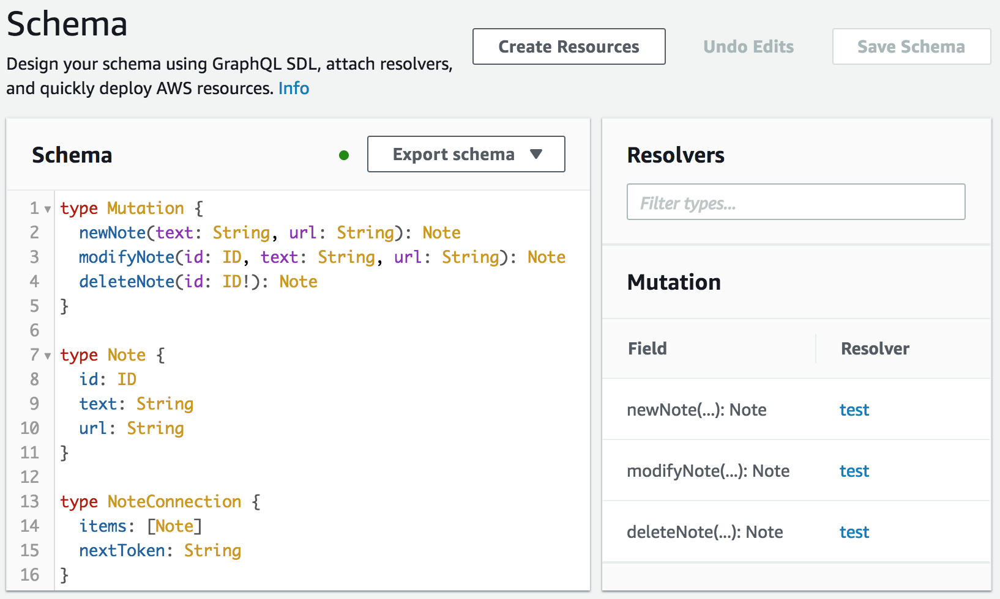

# Lab Instructions
The goal of this lab is to use React and the various AWS MobileHub services along with AWS Transcribe build a simple audio notes application that asynchronously generates text transcription of voice notes.

## First Steps
* Start Firefox (microphone integration in later steps will be easier if you use this browser) and log into the AWS Console with the given credentials. Ensure that the active region is set to 'N. Virginia' (towards the top-right corner of the console).
* Click on the Cloud9 service in the 'AWS Services' list
* Once the Cloud9 console has loaded, you will be presented with a list of environments - in the one named 'notable', click on the 'Open IDE' button

## Dependencies
Let's bootstrap our Node environment with some packages. Run the following commands in the Cloud9 Terminal:

```
nvm i v8
npm i -g create-react-app
npm i -g awsmobile-cli
```

## Grab Some Code
While still in the terminal git clone the base code with:

```
git clone https://github.com/lurkerbot/notable-lab.git
```

Then change into that directory:

```
cd notable-lab
```

And then install the packages it requires:

```
npm i
npm i aws-amplify aws-amplify-react
```

## Create a new MobileHub app
From that same directory we'll instantiate a new MobileHub application (when prompted, specify a new backend):

```
awsmobile init
```

Note: provide the account id [ID] and secret [SECRET]

Select 'us-east-1' as the region

## Connect up the Code

Now we've locally created a new application and associated backend details, let's add a dependency on AppSync and push the new application details to the MobileHub service:

```
awsmobile appsync enable
awsmobile push
```

## Configure AppSync
So that our new application can use its Cognito user pool to authenticate against the AppSync service, open the AppSync console:

```
awsmobile appsync console
```

and go to Settings and:
* enable 'Amazon Cognito User Pool'
* set the region to 'US-EAST-1'
* select the user pool
* set the default action to 'ALLOW'

once you have completed this, go back to the Cloud9 Terminal and refresh the local configuration files with:

```
awsmobile pull
```

Once this command completes open the file 'AppSync.js' in the Cloud9 editor (in the 'src' subfolder) and set the 'graphqlEndpoint' value to the URL in 'API URL' field in the AppSync console.

## Configure AppSync Backend
### Build the GraphQL schema
Now we've created a new MobileHub application and pointed its configuration at the relevant AppSync endpoint, we need to build the AppSync (GraphQL) schema our application will use for persistence. Once the schema has been specified we will attach the query and mutation methods to the DynamoDB table to be used as storage for the business model.

Launch the AppSync console with `awsmobile appsync console` and navigate to the Schema section. Paste the contents of docs/appsync-schema.graphql into the Schema text field and select 'Save'.

<center></center>

### Attach the Resolvers
To associate each of the queries and mutations we've just set in our Schema, an entry will be listed on the right of the AppSync console Schema page (under the 'Resolvers' heading), and we now need to attach each in turn. To do this open the appsync-resolvers.txt file in the docs folder and select the JSON entry under each // heading, click on the 'Attach' button and paste it into the 'Configure the request mapping template' field on the subsequent page. After you have set each mapping template, select 'Save Resolver'.

Note: when you attach the allNotes query, ensure that the 'Configure the response mapping template' drop-down is set to 'Return a list of results'.

## Configure User Storage
So that we can integrate the various components of this application with the user storage (S3) backend that was created by the `awsmobile init` command, we need to update it's Cross-Origin Resource Sharing (CORS) policy. To do this, open the S3 console and open the bucket referred to in the 'aws_user_files_s3_bucket' section of the 'aws-exports.js' configuration file. Once you have this bucket details open in the console, click on the 'Permissions' tab followed by the 'CORS Configuration' button. Paste the contents of the 's3-cors-policy.txt' file into the CORS configuration editor and select 'Save'.

## Implement the transcription Lambda
We are going to build a simple Python Lambda that is triggered when our application uploads a new voice note to the S3 bucket that user files are stored in. To do this, open the Lambda console, 

* create a new Python 3.6 Lambda from scratch (use a name like 'notable_transcription_lambda')
* Set the execution role to 'lambda_execution_role'
* add an S3 trigger for the bucket we set the CORS configuration for, with the prefix 'public/' and suffix '.wav'
* set the timeout to 3 minutes
* Open the 'transcribe-lambda.py' file in 'docs' and paste the contents into the function code form in the Lambda console
* select 'Save'
* select 'Actions' -> 'Publish new version' (setting the version to 1)

## Launch the app in Preview
Now that all the components have been built and configured, navigate to the Cloud9 Terminal and type `npm start` and select 'Preview Running Application' from the 'Preview' menu. Depending on how you have arranged your Cloud9 tabs, you should be presented with something like:


If your application renders in the preview pane with a signup page, that's a good sign :) The next step is to create a Cognito user via the 'Sign Up' link. Complete the user sign-up details (ensuring that you provide a mobile number for SMS MFA). Enter the SMS confirmation code into the next form and click 'Confirm' (the enter key will have no effect). Proceed to sign in with the account details you have just supplied. The preview pane should now look something like:


No you can record a voice memo by pressing the 'Record' to start and the 'Save' button to finish. While the application is waiting for the transcription to complete asynchronously, an activity pulse animation will be visible.


Within a minute, the transcription should complete, and the text appear to the right of the audio playback control.