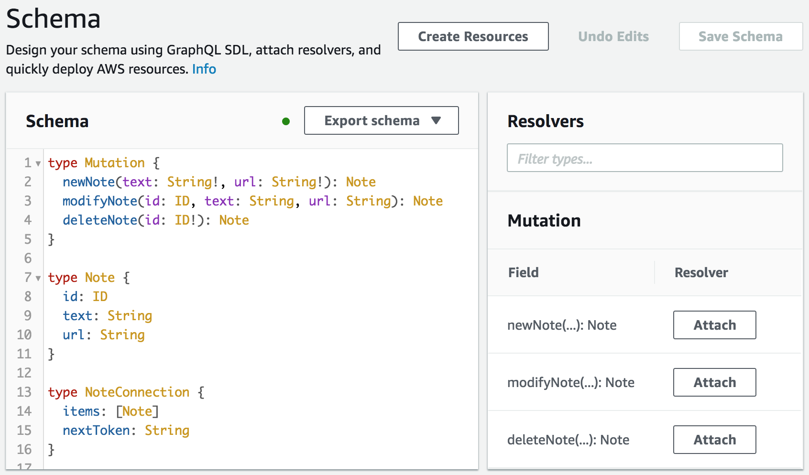
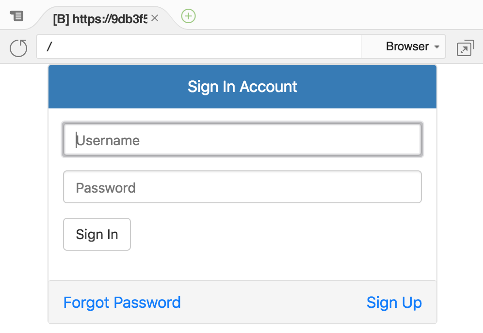
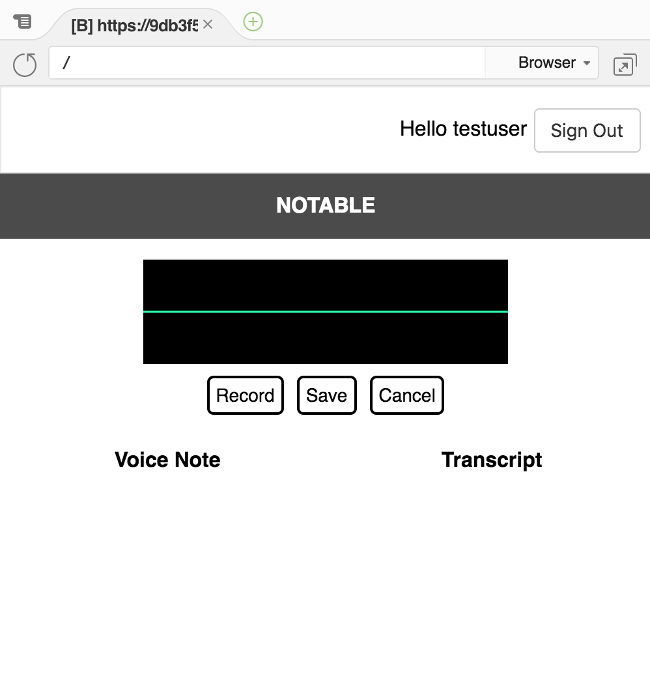
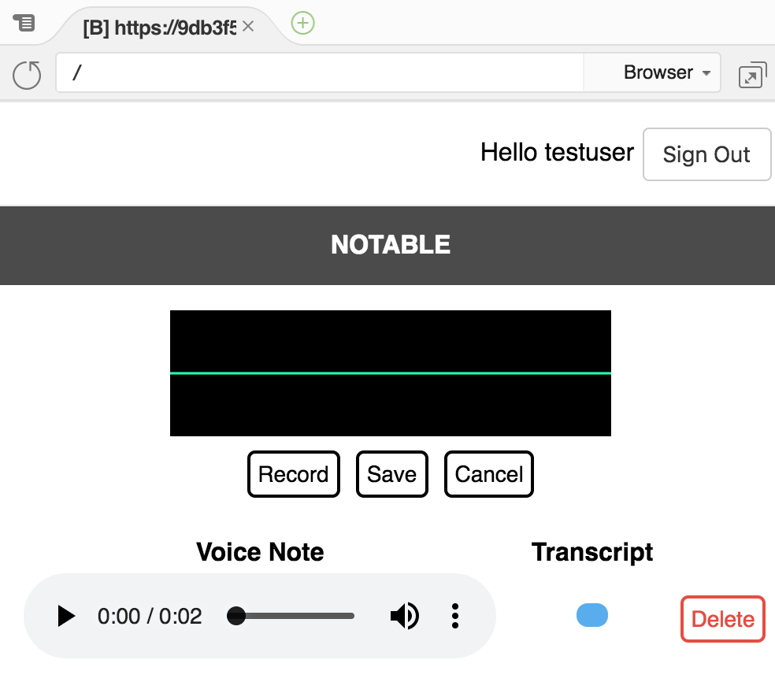

# Lab Instructions
The goal of this lab is to use React and the various AWS MobileHub services along with AWS Transcribe build a simple audio notes application that asynchronously generates a text transcription of voice notes. The basic flow of the lab will be:
* take a minimally configured amplify-react mobile applications shell
* wire up the AWS AppSync backend to a DynamoDB table
* implement an AWS Lambda function to utilise AWS Transcribe for asynchronously transcription of user data
* run the resulting react application
* profit :)

## First Steps
* start Firefox (microphone integration in later steps will be easier if you use this browser) and log into the AWS Console with the given credentials. Ensure that the active region is set to "Oregon" (towards the top-right corner of the console)
* click on the Cloud9 service in the "AWS Services" list
* once the Cloud9 console has loaded, you will be presented with a list of environments - in the one named "amplify-transcribe-cloud9", click on the "Open IDE" button

## Navigate The Project
On the left of the Cloud9 environment, there should be a folder structure - expand the amplify-transcribe-cloud9 folder and note the content within the second folder. To ensure all the modules required to bootstrap the project are installed, navigate to the Cloud9 terminal and enter:

```
cd ~/environment/notable-lab
./startlab.sh
```

## Attach the AppSync Resolvers

The application we are building in this lab uses a subset of the rich functionality available through GraphQL and AWS AppSync, but in this case AppSync can be considered an object mapping layer, with the GraphQL schema mapping queries and mutations to actions on a user DynamoDB table via "Resolvers". Now that we have the base notable-lab project open in a Cloud9 tab, we should use the awsmobile CLI to open the relevant AppSync console page to configure our resolvers. To do this enter the following command in the Cloud9 terminal pane:

```
awsmobile appsync console
```

Left-click on the URL that is printed in the terminal and select "Open".

Once the AppSync console tab opens, click on the "Schema" link on the left. To associate each of the two queries and three mutations we've just set in our Schema, an entry will be listed on the right of the AppSync console Schema page (under the 'Resolvers' heading), and we now need to attach each in turn. To do this:
* double-click to open the appsync-resolvers.txt file in the docs folder within the Cloud9 notable-lab project
* select and copy the JSON dictionary text under each "//" heading
* click on the 'Attach' button for the matching Mutation or Query action
* in the data source drop-down menu, select "NoteTable"
* take JSON text that was copied in the first step and paste it into the 'Configure the request mapping template' field (delete the sample text first)
* after you have set each mapping template, select 'Save Resolver'
* once saved, you can click on the "Schema" link on the left to repeat the process

The screenshot below shows the unattached resolvers on the right:

<p align='center'></p>

Note: when you attach the **allNotes** query, ensure that the 'Configure the response mapping template' drop-down is set to 'Return a list of results'.

## Implement the transcription Lambda
We are going to build a simple Python Lambda that is triggered when our application uploads a new voice note to the S3 bucket that user files are stored in. To do this, open the Lambda console by going back to the original Cloud9 Environments tab, select "Services" from the top left region of the page, then right-click on "Lambda", selecting "Open Link in New Tab". 
* navigate to the newly opened Lambda console page
* left click on the function named "transcriber"
* navigate to the Function about half-way down the page:

<p align='center'></p>

* switch back to the Cloud9 tab and open "docs/transcribe-lambda.py" copying the contents
* paste this text into the lambda_function code editor (replacing the stub code)
* click the "Save" button towards the top-right of the Lambda tab

## Launch the app in Preview
Now that all the components have been built and configured, navigate to the Cloud9 Terminal and type `npm start` and select 'Preview Running Application' from the 'Preview' menu. Depending on how you have arranged your Cloud9 tabs, you should be presented with something like:

<p align='center'></p>

If your application renders in the preview pane with a signup page, that's a good sign :) The next step is to create a Cognito user via the "Sign Up" link. Complete the user sign-up details (ensuring that you provide a mobile number - in the form +61XXXXXXXXX - for SMS MFA). It is worth noting that the account sign-up process in this step has strong password requirements; a mixture of upper case, lower case, numeric and punctuation characters will be needed. Enter the SMS confirmation code into the next form and click "Confirm" (the enter key will have no effect). Proceed to sign in with the account details you have just supplied. The preview pane should now look something like:

<p align='center'></p>

No you can record a voice memo by pressing the "Record" to start and the "Save" button to finish. While the application is waiting for the transcription to complete asynchronously, an activity pulse animation will be visible.

<p align='center'></p>

Within a minute, the transcription should complete, and the text appear to the right of the audio playback control.