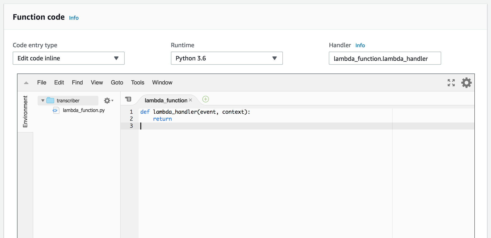

# Amplify/AppSync/Transcribe Lab Instructions

The goal of this lab is to use React, AWS AppSync and supporting services (S3, DynamoDB, Cognito and Lambda) along with AWS Transcribe build a simple audio notes application that asynchronously generates a text transcription of voice notes. The basic flow of the lab will be:

* take a minimally configured amplify-react mobile applications shell
* wire up the AWS AppSync backend to a DynamoDB table
* implement an AWS Lambda function to utilise AWS Transcribe for asynchronous transcription of user data
* run the resulting react application
* profit :)

## First Steps

* start Firefox (microphone integration in later steps will be easier if you use this browser) and log into the AWS Console with the given credentials (https://console.aws.amazon.com/console/home). Ensure that the active region is set to "N. Virginia" (towards the top-right corner of the console)
* click on the Cloud9 service in the "AWS Services" list
* once the Cloud9 console has loaded, you will be presented with a list of environments - in the one named "amplify-transcribe-cloud9", click on the "Open IDE" button

## Navigate The Project

On the left of the Cloud9 environment, there should be a folder structure - expand the amplify-transcribe-cloud9 folder and note the content within the second folder. To ensure all the modules required to bootstrap the project are installed, navigate to the Cloud9 terminal and enter:

```
cd ~/environment/notable-lab
./startlab.sh
```
## Initialise the Amplify Project

```
amplify init
```

* When asked for the lab and environment name,
    give ```notable```
    and
    ```notable```
    respectively

* When prompted, select
   
    ```
    > “Visual Studio Code”
    ```

    then for type of app
    ```
    > “javascript”
    ```

    then for “javascript framework”
    ```
    > react
    ```

* For the next four, accept the defaults:
    ```
    ? Source Directory Path:  src
    ? Distribution Directory Path: build
    ? Build Command:  npm run-script build
    ? Start Command: (npm run-script start)
    ```

* When prompted for the AWS profile, select 'Y' and 'default'


## Add the AppSync Backend

Enter the command

```
amplify add api
```

and respond to the prompts with the following:

* When prompted for the mentioned service, select
    ```
    > GraphQL
    ```

* When prompted for the api name, give
    ```
    > api
    ```

* When prompted for 'authorization type', select
    ```
    > Amazon Cognito User Pool
    ```

* When prompted for the 'default authentication and security configuration', select
    ```
    > Default configuration.

    > Username

    o Email
    ```

* When asked 'Do you have an annotated GraphQL schema?', select
    ```
    > N
    ```

* When asked 'Do you want a guided schema creation?', select
    ```
    > n
    ```

* When prompted for a custom type name, give
    ```
    > Note
    ```


Note: based on the selection of Cognito, this action also adds the 'auth' amplify module.

## Add Storage (S3)

Enter the command

```
amplify add storage
```

and respond to the prompts with the following:

* When prompted for one of 'the below mentioned services', select
    ```
    > Content (Images, audio, video, etc.)
    ```

* When asked for 'a friendly name for your resource', accept the default
* When asked to 'provide a bucket name', accept the default but ensure you make note of the suggested name by selecting and copying it
* When asked 'Who should have access', select
    ```
    > Auth users only
    ```
* When asked 'What kind of access do you want for Authenticated users?', press the space bar to select
    ```
    > create/update
    > delete
    > read
    ```

## Push the Amplify Configuration

Enter the command

```
amplify push
```

and respond to the prompts with the following:

* When asked if you're sure you want to continue, press return
* When asked if 'you want to generate code for your newly created GraphQL API', give 'n'

At this point, amplify will build the Cloud Formation for your amplify project, which can take a few minutes to complete.

## Test!
Assuming the push command completed successfully, type

```
npm start
```

which will launch a local instance of the application.

## Attach the AppSync Resolvers

The application we are building in this lab uses a subset of the rich functionality available through GraphQL and AWS AppSync, but in this case AppSync can be considered an object mapping layer, with the GraphQL schema mapping queries and mutations to actions on a user DynamoDB table via "Resolvers". Now that we have the base notable-lab project open in a Cloud9 tab, we should open the relevant AppSync console page to configure our resolvers. To do this, open the AppSync console by going back to the original Cloud9 Environments tab, select "Services" from the top left region of the page, then right-click on "AppSync", selecting "Open Link in New Tab".

Once the AppSync console tab opens, select the API named ", click on the "Schema" link on the left. To associate each of the two queries and three mutations we've just set in our Schema, an entry will be listed on the right of the AppSync console Schema page (under the 'Resolvers' heading), and we now need to attach each in turn. To do this:

* double-click to open the appsync-resolvers.txt file in the docs folder within the Cloud9 notable-lab project
* select and copy the JSON dictionary text under each "//" heading
* click on the 'Attach' button for the matching Mutation or Query action
* in the data source drop-down menu, select "NoteTable"
* take JSON text that was copied in the first step and paste it into the 'Configure the request mapping template' field (delete the sample text first)
* after you have set each mapping template, select 'Save Resolver'
* once saved, you can click on the "Schema" link on the left to repeat the process

The screenshot below shows the unattached resolvers on the right:

<p align='center'><kbd></kbd></p>

Note: when you attach the **allNotes** query, ensure that the 'Configure the response mapping template' drop-down is set to 'Return a list of results'.

## Implement the transcription Lambda

We are going to build a simple Python Lambda that is triggered when our application uploads a new voice note to the S3 bucket that user files are stored in. To do this, open the Lambda console by going back to the original Cloud9 Environments tab, select "Services" from the top left region of the page, then right-click on "Lambda", selecting "Open Link in New Tab".

* navigate to the newly opened Lambda console page
* left click on the function named "transcriber"
* navigate to the Function about half-way down the page:

<p align='center'><kbd></kbd></p>

* switch back to the Cloud9 tab and open "docs/transcribe-lambda.py" copying the contents
* paste this text into the lambda_function code editor (replacing the stub code)
* click the "Save" button towards the top-right of the Lambda tab

Once this is complete, we need to connect object creation events in the application s3 bucket to the transcription lambda. To do this, type:

```
./docs/s3connect.sh {PASTE COPIED BUCKET NAME HERE}
```

## Launch the app in Preview

Now that all the components have been built and configured, navigate to the Cloud9 Terminal and type `npm start` and select 'Preview Running Application' from the 'Preview' menu. Depending on how you have arranged your Cloud9 tabs, you should be presented with something like:

<p align='center'><kbd></kbd></p>

If your application renders in the preview pane with a signup page, that's a good sign :) The next step is to create a Cognito user via the "Sign Up" link. Complete the user sign-up details (ensuring that you provide an email address you currently have access to, for account registration confirmation). It is worth noting that the account sign-up process in this step has strong password requirements; a mixture of upper case, lower case, numeric and punctuation characters will be needed. Enter the emailed confirmation code into the next form and click "Confirm" (the enter key will have no effect). Proceed to sign in with the account details you have just supplied. The preview pane should now look something like:

<p align='center'><kbd></kbd></p>

No you can record a voice memo by pressing the "Record" to start and the "Save" button to finish. While the application is waiting for the transcription to complete asynchronously, an activity pulse animation will be visible.

<p align='center'><kbd></kdb></p>

Within around a minute, the transcription should complete, and the text appear to the right of the audio playback control.

## Further Reading

* AWS AppSync & GraphQL - <https://docs.aws.amazon.com/appsync/latest/devguide/designing-a-graphql-api.html>
* Getting started with Amazon Transcribe - <https://aws.amazon.com/blogs/aws/amazon-transcribe-scalable-and-accurate-automatic-speech-recognition/>
* AWS Mobile Hub - <https://aws.amazon.com/mobile/>
* AWS Amplify - <https://aws.amazon.com/blogs/mobile/announcing-aws-amplify-and-the-aws-mobile-cli/>